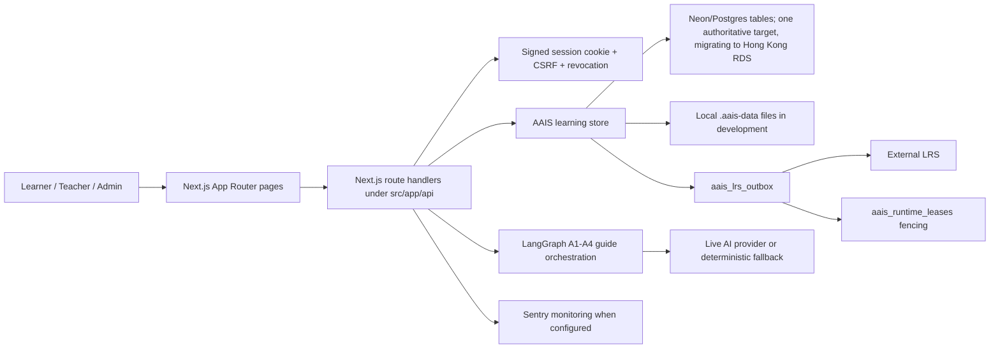

# AAIS Architecture

## Runtime Shape

AAIS is a single Next.js App Router application. The repository supports an
Aliyun Hong Kong container primary with Vercel as a same-SHA cold application backup;
until provider and domain acceptance closes, the live domain remains Vercel.
It uses:

- React client components for the learner cockpit, login, and teacher dashboard.
- Next.js route handlers under `src/app/api/` for auth, learner sessions, AI guide turns, exports, analytics, LRS health, and readiness.
- Signed HttpOnly AAIS session cookies, server-side session revocation, plus actor-bound CSRF tokens for state-changing learner APIs.
- Neon/Postgres for production learner state and LRS outbox persistence.
- File storage in `.aais-data/` for local development only.

## Product Agents

The product contract is A1-A4:

- `A1` Guide Agent: student-facing CA flow and scaffold support.
- `A2` Expert Agent: expert modelling and coaching.
- `A3` Supervision Agent: backend monitoring and scaffold signals.
- `A4` Reflection Agent: articulation/reflection prompts and comparison reports.

`src/data/aais.ts` owns the agent definitions, task data, and `aaisCognitiveApprenticeshipBackground`. AI orchestration must pass that background into every A1-A4 model provider call so live providers and deterministic fallbacks share the same pedagogy.

## Data Flow

1. A user authenticates through `/api/auth/app-session` or future OIDC.
2. The server signs an AAIS session token and CSRF token.
3. `/api/learning/session` reads or writes the learner session for the server-derived actor id.
4. Learner events are appended to the session payload, dual-written to `aais_events`, and mirrored into the LRS outbox.
5. `/api/learning/analytics` returns either the learner summary or role-gated cohort analytics.
   In Postgres mode, cohort analytics aggregate from indexed `aais_events` rows rather than scanning learner-session blobs.
6. `/api/learning/recommendations` derives deterministic rule-based follow-ups from pseudonymized cohort analytics.
   Teacher/admin override decisions are appended as redacted `recommendation_override_recorded` events.
7. The teacher dashboard consumes pseudonymized cohort data, recommendations, and export APIs.

## Persistence

Current production persistence is:

- `aais_learner_sessions`: one JSONB learner-session snapshot per student, with optimistic versioning.
- `aais_learner_task_state`: current per-task state, status, scaffold counts, and text-length metrics without raw learner text.
- `aais_events`: append-only learning evidence rows backfilled from session blobs and dual-written for new events.
- `aais_lrs_outbox`: persistent delivery queue for xAPI/LRS mirroring.
- `aais_login_rate_limits`: durable login failure counters for serverless rate limiting.
- `aais_users`: database-backed student, teacher, and admin accounts.
- `aais_user_auth_tokens`: hashed one-time invite and password-reset tokens.
- `aais_session_revocations`: hashed session-token denylist rows used after logout until the original token expiry.
- `aais_courses`: course catalog metadata seeded from the current Cognitive Apprenticeship program.
- `aais_course_tasks`: ordered task catalog rows with localized titles, briefs, difficulty, lock rules, and expert traces.
- `aais_enrollments`: user-to-course membership rows with cohort labels for real-account pilots.
- `aais_schema_migrations`: migration ledger.
- `aais_runtime_leases`: provider-neutral worker leadership and fencing generation. The Aliyun-primary topology schedules product workers only on Aliyun; Vercel cron is disabled.
- `aais_runtime_identity`: one non-secret database-resident target identifier used by traffic readiness to reject a schema-compatible but incorrect source, rehearsal, or RDS database.

Schema changes must be made through `migrations/postgres/` and applied with `npm run db:migrate`. Runtime request handlers must not issue DDL.

## Monitoring

`@sentry/nextjs` instruments the browser, Node.js route handlers, edge middleware, App Router request errors, and `src/app/global-error.tsx` when `NEXT_PUBLIC_SENTRY_DSN` or `SENTRY_DSN` is configured. Explicit AAIS monitoring events use `src/lib/server/aais-monitoring.ts` and redact learner text, prompts, cookies, tokens, credentials, email-like fields, and secrets before reporting.

## Accessibility And Responsive Baseline

AAIS includes a global keyboard skip link to the shared page content target, visible focus states on interactive controls, reduced-motion CSS handling, and a Playwright phone-width smoke for the learner cockpit. The current responsive contract is that login and learning remain usable on a phone-width viewport, while teacher/admin operational tables are optimized for tablet and desktop review.

## Privacy Lifecycle

Learners can export or delete their own learning data through `/api/learning/privacy`:

- `GET` returns an owner-scoped JSON export for the signed-in actor. It can include raw learner text and is never used for cohort analytics.
- `DELETE` requires the signed-in actor and CSRF token, then removes the learner session, events, task state, and persistent LRS outbox rows for that actor.
- Account records are retained so administrators can manage identity lifecycle, SSO linkage, invites, password reset state, and audit obligations separately from learner content deletion.

Cohort exports and dashboards remain pseudonymous and do not expose raw learner artifacts.

The operational privacy baseline lives in `docs/privacy-data-inventory.md`. It maps the current storage tables, export/delete behavior, retention boundaries, processor/DPA register, and consent/minor-user gate. Owner/provider confirmations are still required before a real cohort: first cohort age/region/institution, formal retention schedule, consent workflow, Neon/Vercel/LRS/Sentry/email/AI provider DPAs, and data-region terms.

## Boundaries

Keep these stable unless a task explicitly changes them:

- Server-derived identity: do not trust client-sent `studentId`.
- Session revocation: protected API routes and protected pages must check the server-side denylist before accepting a signed cookie.
- Redacted logging: never log secrets, cookies, database URLs, raw provider replies, or learner text beyond the learner-owned storage path.
- Production storage: fail closed if production lacks Postgres.
- LRS outbox: keep retry/dead-letter behavior isolated from request handlers.
- API errors: route handlers return stable `{ error: { code, message } }` envelopes. Unexpected exception details stay in redacted server logs/monitoring, not client JSON.
- Monitoring: do not enable default PII or Session Replay without a separate privacy review.
- CSP: page responses use middleware-generated nonce-based `script-src` and `style-src`; development keeps React debugging allowances, but production removes `unsafe-inline` and `unsafe-eval`.
- AI runtime guardrails: guide requests have a per-student daily request cap via `AAIS_AI_DAILY_GUIDE_LIMIT`, live provider calls default to one retry and a 600-token response ceiling, and the learning cockpit requests staged SSE progress with visible fallback labeling.

## Not Yet

These are planned but not current architecture:

- Owner-run production account seeding and provider-side email/domain setup.
- Runtime course/task reads still use `src/data/aais.ts`; the catalog tables are the migration target for moving course authoring out of source code.
- Owner/provider privacy confirmations outside code: final legal basis, signed retention values, consent evidence workflow, processor DPAs, and external provider data-region proof.

Do not add heavier infrastructure until a trigger is actually met:

- Separate API service: revisit when route handlers block independent deploy cadence, background jobs need long-lived workers, or the team has more than one backend owner.
- Message queue beyond `aais_lrs_outbox`: revisit when non-LRS workflows need durable async processing with retry, dead-letter review, and operator tooling.
- Redis or cache tier: revisit when measured Postgres or session-read latency, not guesses, becomes the bottleneck; rate limiting can use Postgres until then.
- Multi-region deployment: revisit when AAIS has confirmed cross-region cohorts, data-residency requirements, and an operations owner for failover drills.
- ML pipeline: revisit after rule-based recommendations have teacher override data, enough labeled learner outcomes, and a documented evaluation protocol.
- CMS or authoring system: revisit when teachers must author or revise courses weekly instead of seeding course/task data through reviewed migrations or source data.
