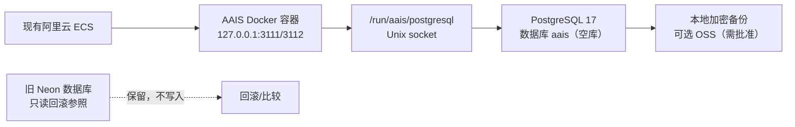

# AAIS 阿里云自托管 PostgreSQL（空数据库）运行手册

当前发布隔离及阻塞以 [release-split.md](release-split.md) 为准。GHCR 仅允许
手动发布精确候选分支；本候选不得合入 Vercel 生产分支。Owner 凭据入口在
精确受审计启动器完成绑定之前始终拒绝，不能通过环境开关或 TTY 模拟放行。

本手册是 `codex/aais-aliyun-postgres-empty` 候选分支的数据库路线。它只
准备本地代码、SQL 和操作证据，不创建 ECS、RDS、OSS、KMS、HSM、SLB 或
任何其他收费资源，也不读取或保存 Owner 凭据。

## 1. 已冻结的假设

- 继续使用现有阿里云 ECS；不新增服务器。
- 在该 ECS 上安装并维护 PostgreSQL 17，数据库名为 `aais`。
- AAIS 应用是唯一写入方，使用 `aais_app_aliyun` 角色和本机 Unix socket
  `/run/aais/postgresql`。PostgreSQL 不监听公网 TCP；Docker 容器以只读方式
  挂载该 socket 目录。
- `AAIS_DATABASE_DRIVER=pg`、`AAIS_DATABASE_PROVIDER=aliyun-postgres`、
  `AAIS_DATABASE_TRANSPORT=unix` 是这条路线的唯一生产绑定。
- Neon 数据库不删除、不修改、不迁移；它只作为旧环境/回滚参照保留，直到
  Owner 另行批准关闭。新库是空库，因此不会带来 Neon 中已有的账号、学习
  记录、事件、LRS outbox 或研究数据。
- Vercel 不再是该路线的数据库写入方。现有 Vercel/Neon 部署保持冻结，不能
  被“新库已初始化”这一事实自动切换。

状态关系如下：



## 2. 本地候选内容

- `src/lib/server/aais-postgres-pool.ts` 接受两种明确的生产传输：旧 Neon 的
  `verify-full`，或本路线的本机 Unix socket。自托管分支禁止远程主机、IP
  字面量、重复 `sslmode`、`sslrootcert` 和
  `NODE_TLS_REJECT_UNAUTHORIZED=0`。
- `deploy/aliyun/aais-deploy.sh` 在启动容器前检查 socket 目录为真实目录、
  非符号链接、模式 `0770`，并只读挂载到容器；运行时环境必须明确绑定
  `aliyun-postgres/unix`。
- `deploy/aliyun/postgres-open-migrator.sql`、
  `postgres-close-migrator.sql` 和 `postgres-runtime-roles.sql` 将迁移角色
  与运行时角色分开。迁移窗口关闭后，`aais_migrator` 为 `NOLOGIN`、无数据库
  连接权、无 schema/table/sequence/function 权限。
- `deploy/aliyun/aais-runtime.env.example` 是注释参考，不是可直接部署的
  secret 文件。真实 `AAIS_DATABASE_URL` 只能由 Owner 在受控的 root-owned
  文件中写入，不能提交 Git、打印日志或放入收据。

## 3. Owner 一次性操作（全部为人工门）

以下动作必须由 Owner 在独立的系统 Terminal/阿里云控制台完成。Codex 不代
输入密码、AccessKey、MFA、SSH 私钥或数据库口令；如果任一步输出的身份、主机
或数据库不是预期目标，应立即停止。

### 3.1 服务器与 PostgreSQL

1. 仅确认现有 ECS 的实例 ID、地域、机器指纹、可用磁盘和内存；不要购买新
   实例。安装 PostgreSQL 17 的官方/阿里云 Linux 3 软件包，并记录 `postgres
   --version`、数据目录、磁盘文件系统和 `pg_config --configure`。
2. 创建空数据库 `aais`。如果数据库已经存在且包含任何业务行，停止并将本次
   运行标记为 `BLOCKED_NONEMPTY_DATABASE`；不要清空或 `DROP DATABASE`。
3. 创建一个仅供 AAIS 容器使用、数值 GID 为 `10001` 的专用主机组
   `aais-runtime`，并安装
   `deploy/aliyun/aais-postgresql-socket.tmpfiles` 到
   `/etc/tmpfiles.d/aais-postgresql.conf`。为 PostgreSQL 准备专用运行目录
   `/run/aais/postgresql`：目录必须由
   `postgres` 所有、组为仅供 AAIS 容器使用的数值 GID（容器 GID 为 `10001`）、
   模式 `0770`，不能是符号链接。若该 GID 已被不相关服务使用，停止而不是
   复用。
   tmpfiles 同时为父目录 `/run/aais` 设置 `u:postgres:--x` ACL，只允许穿越，
   不授予读取 worker secret generation 的权限。安装后用 `getfacl` 验证，
   并验证 bootstrap 再运行后 ACL 仍在。不要将 postgres 加入可读取 secret 的组。
4. 在 PostgreSQL 配置中设置 `unix_socket_directories='/run/aais/postgresql'`、
   `listen_addresses=''`、`password_encryption='scram-sha-256'`；在
   `pg_hba.conf` 中只允许本 socket 上的 `aais` 数据库和 AAIS 角色使用
   `scram-sha-256`。禁止添加 `0.0.0.0/0`、公网 ECS 地址或临时 `trust` 规则。
5. 重启 PostgreSQL 后，从本机只读检查 socket、监听地址、版本、编码、区域、
   扩展和 `pg_hba.conf` 生效内容。将检查结果写入不含口令的运维收据。

### 3.2 空库迁移与最小权限角色

迁移必须使用临时的 `aais_migrator` 口令；应用口令与迁移口令必须不同。口令
只能通过隐藏提示或权限为 `0600` 的临时 `.pgpass` 提供，命令行、shell 历史、
日志和截图不得出现口令。

1. 以数据库 Owner 身份在 `aais` 库执行 `postgres-open-migrator.sql`，并以
   `-v DBNAME=aais` 提供数据库名。此时只打开迁移窗口，不启动 AAIS。
   窗口显式授予数据库 `CONNECT, CREATE, TEMPORARY`：0009 创建新 schema，
   迁移入口需要 `pg_temp`。关闭脚本对称撤销这三项，不依赖 PUBLIC 默认权限。
2. 以 `aais_migrator` 身份运行现有迁移入口：

   ```text
   AAIS_DATABASE_DRIVER=pg
   AAIS_DATABASE_PROVIDER=aliyun-postgres
   AAIS_DATABASE_TRANSPORT=unix
   AAIS_DATABASE_URL=postgresql://aais_migrator:<临时口令>@localhost/aais?host=%2Frun%2Faais%2Fpostgresql&sslmode=disable
   npm run db:migrate
   ```

   这里的 `<临时口令>` 只表示 Owner 在隐藏输入中注入的瞬时值，不得写进
   文件或提交。迁移结果必须报告 `status=ok`，并明确记录 `0028`、`0029` 已
   应用；任何失败都保持维护状态，不得跳过迁移或继续部署。
3. 仍以数据库 Owner 身份执行 `postgres-runtime-roles.sql`（同样使用
   `-v DBNAME=aais`）。它只创建 `aais_app_aliyun` 和 `aais_migrator`，并将
   应用角色限制为显式列出的 AAIS 表、必要函数和 `SELECT`/`UPDATE` 的运行时
   身份表；不创建 `aais_app_vercel`，不授予 DDL、成员继承、复制、绕过 RLS 或
   超级用户权限。
4. 在隐藏提示中为 `aais_app_aliyun` 设置独立的 SCRAM 口令；确认
   `rolsuper=false`、`rolcreatedb=false`、`rolcreaterole=false`、
   `rolreplication=false`、`rolbypassrls=false`、`rolinherit=false`，以及
   `pg_auth_members` 没有任何成员关系。
5. 执行 `postgres-close-migrator.sql`，确认迁移角色为 `NOLOGIN`、数据库连接
   被撤销、活动会话数为 `0`。若仍有会话，不要强制杀其他角色的会话；记录会话
   所属者并停止。
6. 以数据库 Owner 执行 `database-target-identity.sql`，传入一个新的、非秘密的
   `TARGET_ID`（例如 `aais-aliyun-postgres-20260901`）。读取回来的
   `target_id` 必须逐字相同；该 ID 不得与 Neon 旧目标或其他环境复用。
7. 以数据库 Owner 执行 `postgres-empty-preflight.sql -v TARGET_ID=<同一 ID>`。
   该只读预检必须确认数据库名、PostgreSQL 17、socket、无公网监听、29 个迁移、
   target identity、角色边界、成员关系、运行时 allowlist，并确认所有业务/学习/
   事件/outbox/study 表均为空；迁移刻意生成的课程 catalog、admin-lock singleton
   和一条 legacy-archive metadata row 必须精确匹配基线。预检失败时保持
   `BLOCKED_NONEMPTY_DATABASE` 或其他对应错误，不得以手工截图覆盖。

### 3.3 运行时绑定与应用启动

1. 生成 root-owned、模式 `0400` 或 `0600` 的 `/etc/aais/secrets/runtime.env`。
   复制 `aais-runtime.env.example` 的键集合，但只填入新库 URL、应用口令和其
   他已批准的 AAIS secret。至少确认：

   ```text
   AAIS_DATABASE_DRIVER=pg
   AAIS_DATABASE_PROVIDER=aliyun-postgres
   AAIS_DATABASE_TRANSPORT=unix
   AAIS_DATABASE_URL=postgresql://aais_app_aliyun:<应用口令>@localhost/aais?host=%2Frun%2Faais%2Fpostgresql&sslmode=disable
   ```

2. 运行 `aais-secrets-bootstrap.sh`，让它生成 root-owned 的当前代环境；不要
   手工复制 worker 环境。先只启动候选容器，在本机访问 `/api/system/live`、
   `/api/system/readiness` 和 `/api/system/traffic-readiness`。
3. 候选验证通过后，才可依照现有蓝绿部署收据运行 `aais-deploy.sh`。部署脚本
   会把 `/run/aais/postgresql` 以只读方式挂进容器；缺失目录、错误模式或错误
   provider/transport 会在 Docker 启动前失败关闭。
4. 不要在此阶段切换 Vercel、DNS/GTM、邮件、LRS、研究模式或公开访问。它们是
   独立的 Owner/发布门，不能由数据库初始化结果代替。

## 4. 空库验收与证据

必须分别记录本地、ECS、数据库和应用证据，不把 `HTTP 200` 或页面截图当成
数据库完成证明：

- PostgreSQL 17 版本、socket 目录身份/模式、无公网监听、`pg_hba.conf` 规则
  和磁盘容量。
- 迁移 ledger 为 `001`–`0029` 的当前集合，`aais_runtime_identity` 只有一行
  且 target ID 精确匹配；新库中业务表行数为零是预期，不是异常。
- 运行时角色属性、成员关系、连接上限、显式 grants 和迁移角色零会话；收据
  只含布尔值、计数、角色名和非秘密 ID。
- AAIS 容器的镜像 digest、Git SHA、环境 bundle 版本、socket 挂载、
  `AAIS_DATABASE_PROVIDER/TRANSPORT` 和 readiness 结果。
- 备份演练：先执行一次本地 `pg_dump --format=custom`，再在隔离数据库恢复并
  运行迁移/readiness 检查。备份文件不得进入 Git 或普通日志；上传 OSS 之前
  另需 Owner 批准地域、保留期、加密和出网费用。

## 5. 回滚与数据边界

这不是 Neon 的在线迁移。由于新库为空，切换后产生的任何账号、学习记录、事件
和 outbox 不会自动回写 Neon；将应用 URL 改回 Neon 只能回到旧数据状态，不能恢复
新库写入。若切换前后发现问题：

1. 先启用 AAIS 维护/写入冻结并保留两端收据。
2. 保留新 ECS PostgreSQL 数据目录和备份，不执行删除。
3. 由 Owner 明确选择“回到旧 Neon”或“继续修复新库”；任何 `DROP DATABASE`、
   清空表、撤销旧凭据或删除备份都属于 A2 删除操作，必须另行给出精确目标授权。

## 6. 费用闸门

本候选分支在用户批准前的费用为 **0 个新增云资源**。现有 ECS 的 CPU、内存、
磁盘和带宽消耗需要在 Owner 批准前测量；PostgreSQL 软件本身不等于云服务免费，
备份、OSS 存储/请求/出网、监控和快照仍可能产生费用。初始阶段不启用 RDS、KMS、
Cloud HSM、ACR、SLB 或第二 ECS；如需其中任何一项，先提交地域、规格、按量/包年、
月度上限和删除/回收方案，等待明确的费用批准。

## 7. 当前停止点

在以下证据全部具备前，状态保持 `PREPARED_NOT_ACTIVATED`，不得创建收费资源或
执行生产切换：

- 真实 ECS/数据库 Owner 身份与目标实例证据；
- PostgreSQL 17 空库与 socket/监听安全证据；
- 0028/0029 迁移、最小权限角色、target identity 和备份恢复证据；
- 本地候选 SHA、镜像 digest、运行时 secret bundle 和 readiness 证据；
- 独立的服务身份/发布权限证明，以及 Owner 对费用、域名和切换窗口的批准。
